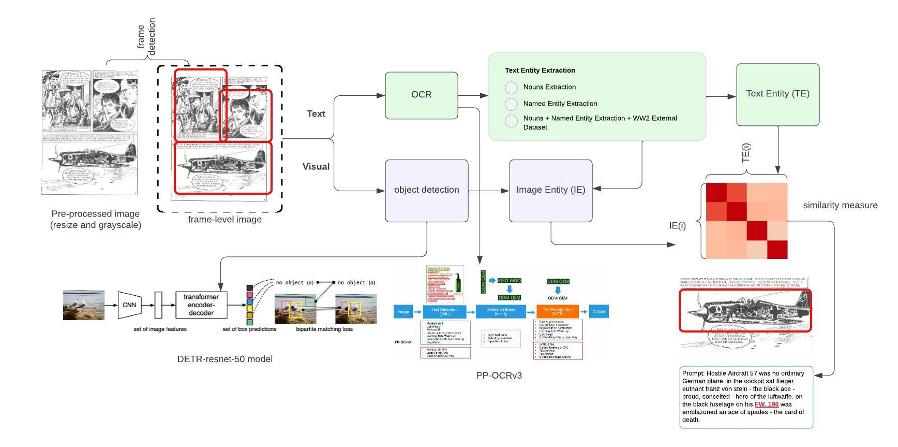

# MSc-Thesis
## Master Information Studies: Data Science track

### Linking Entities Across Texts and Images in Comics
*Author: Xiaoyu Wu, University of Amsterdam, submitted in partial fulfillment for the degree of master of science*

 

## Updates

The code below is run on google colab. 

* 6/2023: Updated [Method2-MDETR model (in comics and standard settings)](MDETR.ipynb) 

* 6/2023: Updated [Entity Pairs Ranking and CLIP in naturalistic/standard settings](Method_Nat_Evaluation.ipynb) where the images are retrieved from the test set in the [Flickr30k dataset](https://github.com/BryanPlummer/flickr30k_entities)

* 5/2023: Updated [Method2-CLIP model (in comics)](CLIP.ipynb)

* 4/2023: Updated [Method1-Entity Pairs Ranking (in comics)](Method1.ipynb) and three csv files from [Kaggle WW2 database](https://www.kaggle.com/datasets/ramjasmaurya/world-war-2-archive)

* 3/2023: Updated [Exploratory Data Analysis](EDA.ipynb) 

## Introduction
Comics, a medium with distinctive structures, present an opportunity for exploring the intersection of visual and language content. In this work, we delve into the field of **visual grounding** in comics, a visual semantic task that aims to connect entities in speech bubbles with those depicted within the image. 

Unlike previous research in visual grounding which primarily focuses on naturalistic images, our study puts the spotlight on comics and presents two novel approaches to address this task. 

1. **Method 1: Entity Pairs Ranking** ranks the image-text pairs retrieved from two-stream detection.
2. **Method 2: Visual Language Transformer** adopts a transformer-based model that learns to integrate image-text representations.

Both methods achieved similar results, with an approximate F1-score of 10% for comics grounding. However, the second method outperformed the first method in terms of naturalistic images, achieving a F1-score of 76.5%.

